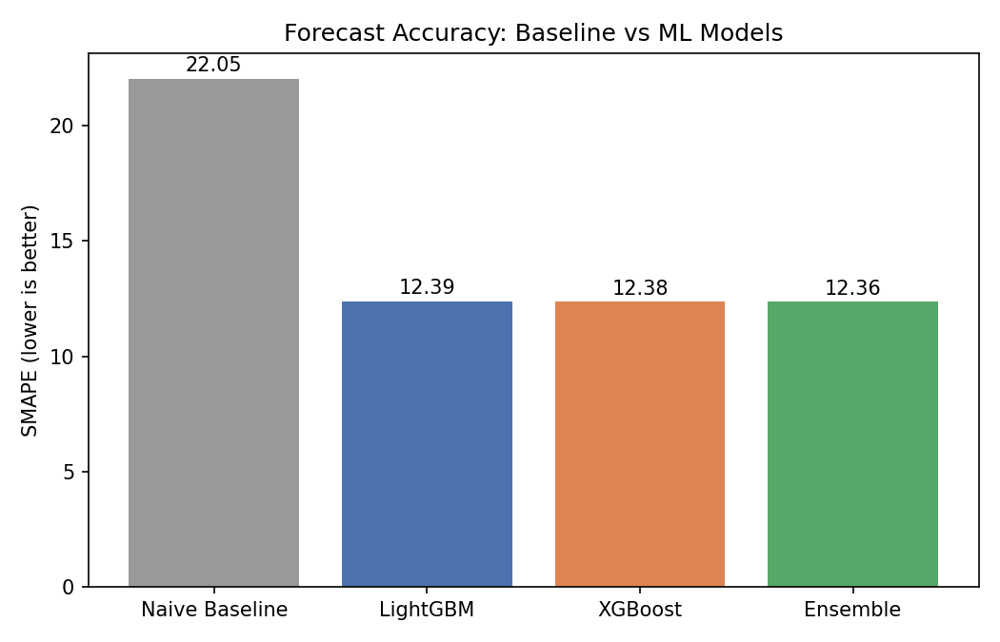
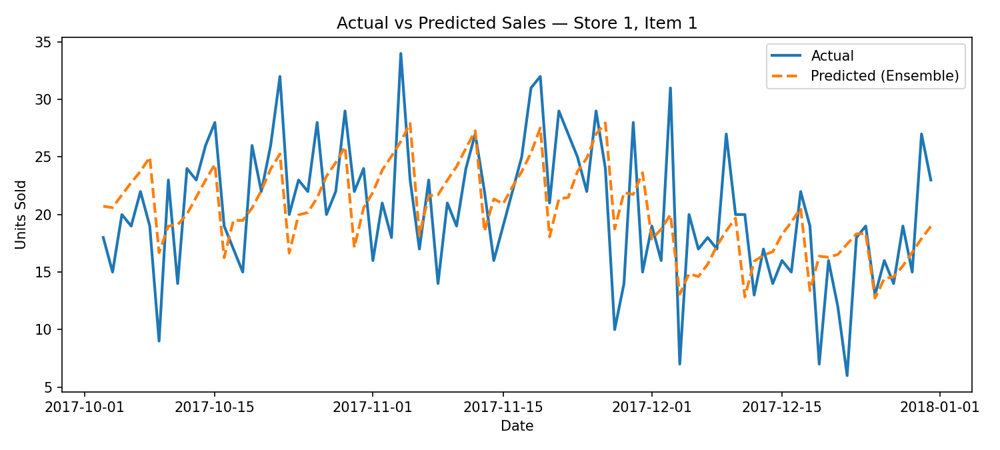
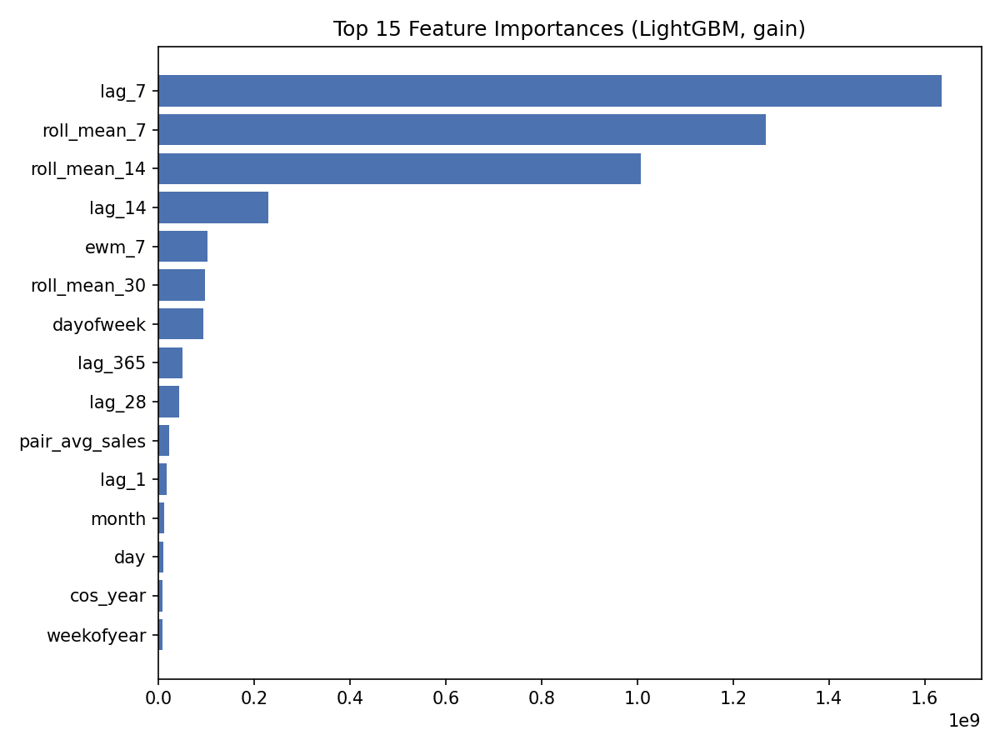

# demand-forecasting-inventory-optimization
# Supply Chain Demand Forecasting & Inventory Optimization

An end-to-end pipeline that forecasts daily retail demand with a LightGBM +
XGBoost ensemble, then translates those forecasts into per-SKU replenishment
decisions (safety stock, reorder point, EOQ).

## Dataset

[Kaggle — Store Item Demand Forecasting Challenge](https://www.kaggle.com/c/demand-forecasting-kernels-only/data)
913,000 daily sales records: 10 stores x 50 items x 5 years (2013–2017).

## Results

| Model | SMAPE | Improvement vs baseline |
|---|---|---|
| Naive seasonal baseline | 22.05 | — |
| LightGBM | 12.39 | 43.8% |
| XGBoost | 12.38 | 43.8% |
| **Ensemble (weighted blend)** | **12.36** | **43.9%** |





## Approach

1. **Feature engineering** (`src/features.py`) — 40 features per store-item
   pair: calendar features, Fourier seasonality encoding, lag features
   (1/7/14/28/90/365 days), rolling mean/std/min/max (7/14/30/90-day
   windows), exponentially weighted means, and store/item/pair historical
   averages. All lag/rolling features are shifted to avoid data leakage.
2. **Modeling** (`src/train.py`) — LightGBM and XGBoost trained
   independently with early stopping, evaluated on a time-based validation
   split (no random shuffling — that would leak future data), then
   ensembled via a weight search on validation SMAPE.
3. **Inventory optimization** (`src/inventory.py`) — per store-item pair,
   computes safety stock, reorder point, and EOQ at a 95% service level
   using the model's backtested forecast error as the demand-uncertainty
   estimate.

## Inventory policy assumptions

The raw dataset has no cost or lead-time fields, so the following are
declared assumptions for the demo (documented, not hidden):
- Lead time: 7 days
- Ordering cost: $50/order
- Holding cost: 20% of unit value/year (unit value assumed $1 as a stand-in)
- Service level: 95% (Z = 1.645)

## How to run

```bash
pip install -r requirements.txt
# Download train.csv from the Kaggle link above into data/raw/
python src/train.py       # trains models, saves to models/, writes val predictions
python src/inventory.py   # computes safety stock / reorder point / EOQ
python src/make_plots.py  # regenerates charts in reports/figures/
```

## Project structure

```
├── data/
│   ├── raw/            # train.csv, test.csv (not committed — see .gitignore)
│   └── processed/      # val_predictions.csv, inventory_policy.csv
├── src/
│   ├── features.py     # feature engineering pipeline
│   ├── train.py         # SMAPE metric, baseline, LightGBM/XGBoost training, ensemble
│   ├── inventory.py     # safety stock / reorder point / EOQ
│   └── make_plots.py   # result visualizations
├── models/              # saved LightGBM/XGBoost model files
├── reports/figures/     # charts used in this README
└── requirements.txt
```
